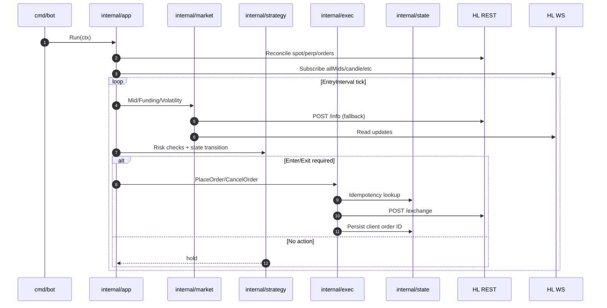

# Repository Architecture

## High-Level Flow
1. `cmd/bot/main.go` loads config, builds logger, wires the app, and starts a graceful shutdown context.
2. `internal/app` reconciles account state, starts market data feeds, and runs the strategy tick loop.
3. Each tick reads market data, runs risk checks, advances the state machine, and executes orders.

## Package Map
- `cmd/bot`: entrypoint and process lifecycle.
- `internal/app`: dependency wiring, reconcile-on-start, and main loop.
- `internal/config`: config schema, defaults, validation, YAML loader.
- `internal/logging`: zap logger setup.
- `internal/hl/rest`: REST client for `POST /info` and `POST /exchange`.
- `internal/hl/ws`: WebSocket client with reconnect/resubscribe logic.
- `internal/market`: market data abstraction (REST + WS) for mids/funding/vol.
- `internal/account`: account reconciliation for spot balances, perp positions, open orders.
- `internal/exec`: order placement/cancel, idempotency, retries with backoff.
- `internal/strategy`: state machine, types, and risk checks.
- `internal/state`: persistent store interface; SQLite implementation.
- `internal/metrics`: counters (currently no-op).
- `internal/alerts`: optional Telegram alerts (stubbed).
- `scripts/systemd`: deployment unit.

## Data and Control Flow
- Startup:
  - REST reconcile (spot balances, perp positions, open orders).
  - Start WS subscriptions for market data.
- Runtime:
  - Strategy tick reads mid price, funding, volatility.
  - Risk checks gate entry/exit and position changes.
  - State machine drives entry, steady state, and exit flows.
  - Executor places/cancels orders with idempotent client order IDs.

## Sequence Diagram (Runtime Tick)

## Restart Safety
- The state store persists client order IDs to prevent duplicate order placement.
- On startup, the app reconciles exposure and open orders before trading.
- Roadmap includes persisting last action and exposure to harden recovery.

## Interfaces and Testability
- `internal/exec.RestClient` and `internal/state.Store` are small, mockable interfaces.
- Unit tests cover state machine transitions, executor idempotency, and SQLite round trips.

## Configuration
- `internal/config/config.yaml` includes endpoints, timeouts, strategy thresholds, and risk limits.
- Config defaults are applied in `internal/config/config.go`.

## Dependencies
- Logging: `go.uber.org/zap`
- YAML: `gopkg.in/yaml.v3`
- SQLite: `modernc.org/sqlite`
- WebSocket: `nhooyr.io/websocket`

## Related Docs
- `docs/roadmap.md`: product plan, state machine design, failure modes, and phased delivery.
